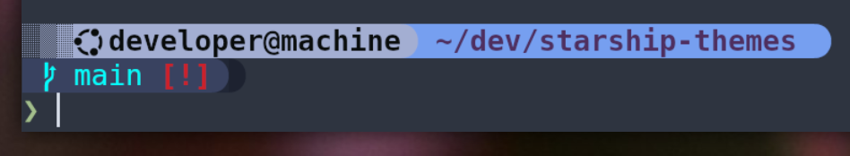
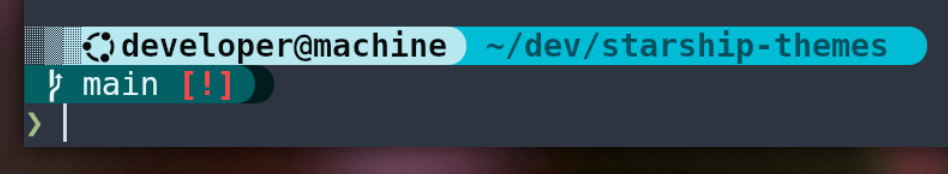
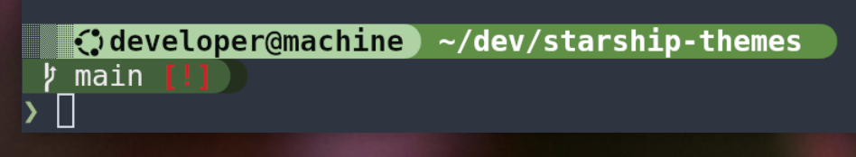
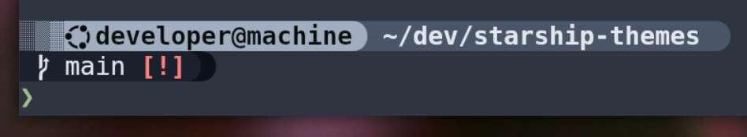
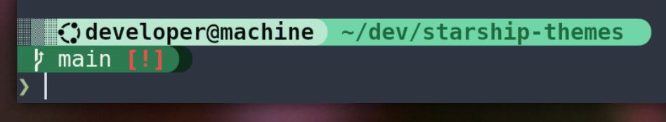
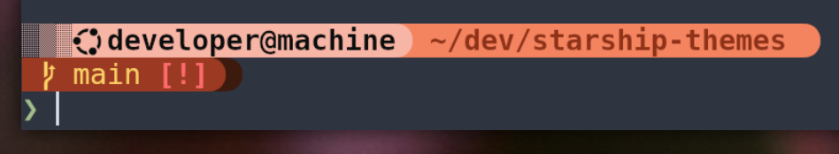
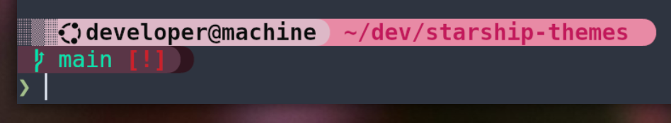
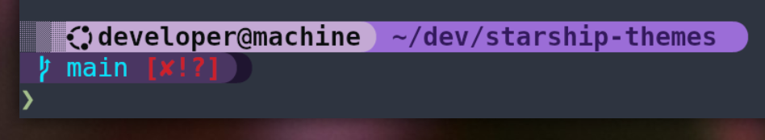
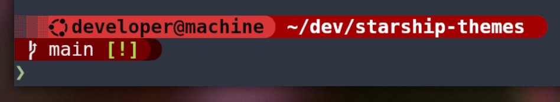
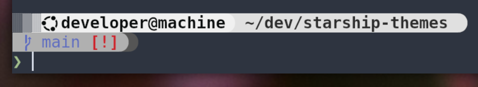

# starship-themes

My collected themes for Starship.rs.

## Inspiration

`starship_blue.toml` and `starship_green.toml` are taken from Starship's own [Tokyo Night Preset](https://starship.rs/presets/tokyo-night.html)

## Features
- Icons to differentiate [between operating systems](screenshots/os_icon_shown.png).
- Multiple colors to differentiate between servers (see Screenshots below).
- [Git status indicators](screenshots/git_status_shown.png) built in.


## Installation

1. Clone this repo locally.
2. Download and install [Starship.rs](https://starship.rs/guide/#%F0%9F%9A%80-installation).
3. Download and install a [NerdFont](https://www.nerdfonts.com/font-downloads). I use FiraCode Nerd Font.
4. Set up your terminal to use that NerdFont you've installed.
5. In your shell's RC file (.zshrc, .bashrc, etc.), add this:

```
# Starship
export STARSHIP_CONFIG=<path-to-cloned-repo>/starship_green.toml
eval "$(starship init zsh)"
```

6. To switch themes, just change the STARSHIP_CONFIG value in your RC file to point to another template.

## Screenshots

[Blue](starship_blue.toml):



[Cyan](starship_cyan.toml):



[Green](starship_green.toml):



[Midnight](starship_midnight.toml):



[Mint](starship_mint.toml):



[Orange](starship_orange.toml):



[Pink](starship_pink.toml):



[Purple](starship_purple.toml):



[Red](starship_red.toml):



[White](starship_white.toml):


